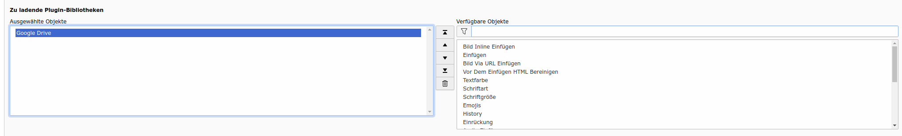

.. raw:: html

  

Google Drive Plugin
-------------------

- Configure the `Google Drive <https://drive.google.com>`_ Plugin.

.. code-block:: json

   "plugins" : {
         "WaXCode_OnlineStorage_Google" : {
         "clientID"            : "00000000-xxxxxx.apps.googleusercontent.com",
         "apiKey"              : "xxxxx",
         "scopes"              : "https://www.googleapis.com/auth/drive",
         "cDriveLinkIcon"      : "/ResolveURN?uid=184",
         "cDriveEmbedIcon"     : "/ResolveURN?uid=187",
         "cDriveDirecotryIcon" : "/ResolveURN?uid=188",
         "cDriveRenameIcon"    : "/ResolveURN?uid=190",
         "cDriveUploadIcon"    : "/ResolveURN?uid=191",
         "cDriveLoaderHTML"    : "/ResolveURN?uid=186"}}

Besides providing URLs to the icons to use the `Google Drive Client-ID, API-Key and the requested Scopes <https://console.cloud.google.com/apis/credentials?hl=en>`_ are mandatory, thus registering your App at `Google Workspace <https://developers.google.com/drive/api/quickstart/js?hl=en>`_ is necessary.

- Define that the `Google Drive <https://drive.google.com>`_ library shall be loaded.

The editor will than have a `Google Drive <https://drive.google.com>`_ Logo - Button.