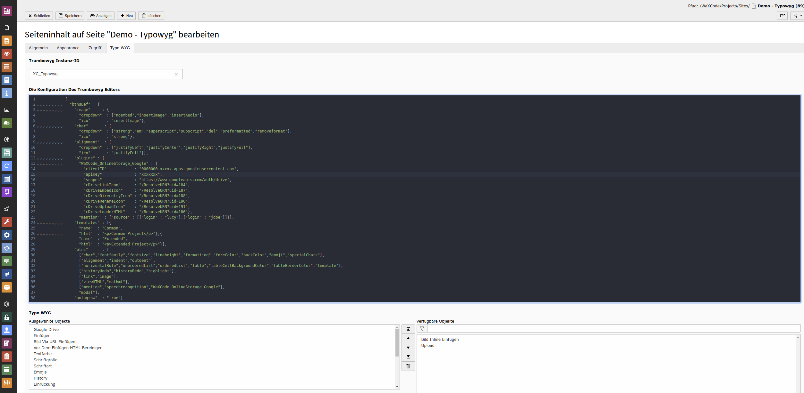

.. raw:: html

  

Screenshots
^^^^^^^^^^^

Das erste Bild zeigt die Konfigurationspalette im Backend. Die anderen zeigen viele der Funktionalitäten die der `Trumbowyg Editor <https://alex-d.github.io/Trumbowyg/>`_'s bietet.

Seht euch die `Live Demo <https://waxcode.net/projects/sites/demo-typowyg>`_ an.

.. container:: table-row

   .. image:: ../../Images/Screenshot1.png
         
   .. image:: ../../Images/Screenshot2.png

.. container:: table-row

   .. image:: ../../Images/Screenshot3.png

   .. image:: ../../Images/Screenshot4.png

.. container:: table-row

   .. image:: ../../Images/Screenshot5.png

   .. image:: ../../Images/Screenshot6.png

.. container:: table-row

   .. image:: ../../Images/Screenshot7.png

   .. image:: ../../Images/Screenshot8.png

.. container:: table-row

   .. image:: ../../Images/Screenshot9.png

   .. image:: ../../Images/Screenshot10.png

.. container:: table-row

   .. image:: ../../Images/Screenshot11.png

   .. image:: ../../Images/Screenshot12.png

.. container:: table-row

   .. image:: ../../Images/Screenshot13.png

   .. image:: ../../Images/Screenshot14.png