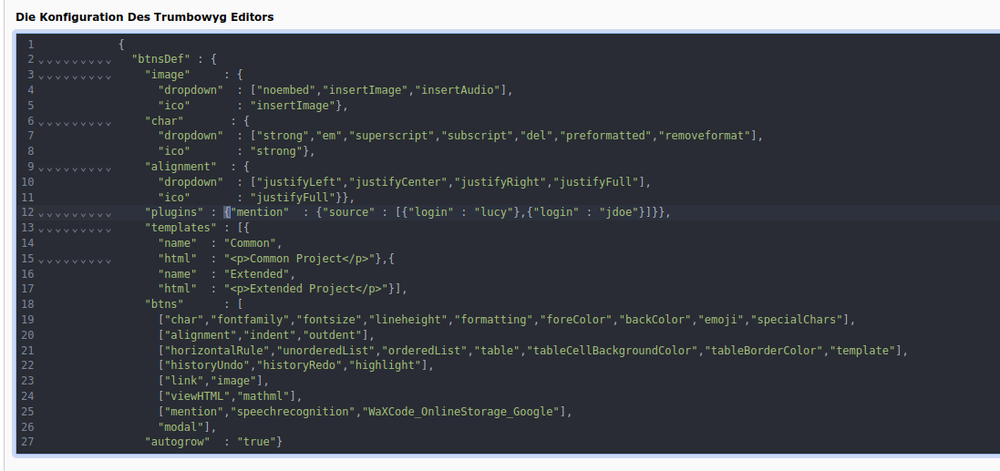

.. raw:: html

  

Trumbowyg Editor
----------------

- Das Viewer-Typoscript zur Site - Template hinzufügen.

- Den Typowyg - Viewer zum Seiteninhalt hinzufügen.

.. image:: ../../Images/AddedEditor.png

- Die Konfiguration des Elements öffnen, zur Typo WYG Palette wechseln und eine Instanz-ID eintragen.

.. image:: ../../Images/InstanzID.png

- Eine entsprechende `Konfiguration <https://alex-d.github.io/Trumbowyg/documentation/plugins/>`_ eingeben.

- Die zu ladenden Plugin-Bibliotheken (wenn z.B. `speechrecognition <https://alex-d.github.io/Trumbowyg/documentation/plugins/#plugin-speechrecognition>`_ in der Konfiguration genutzt wird, ist es auch notwendig die Speechrecognition - Bibliothek hier hinzuzufügen damit diese Funktionalität zur Verfügung steht und der Mikrofon - Button im Editor angezeigt wird ) einbinden.

.. image:: ../../Images/PluginLibraries.png

- Javascript nutzen um auf den vom Nutzer in den Editor eingegeben Inhalt zuzugreifen.

